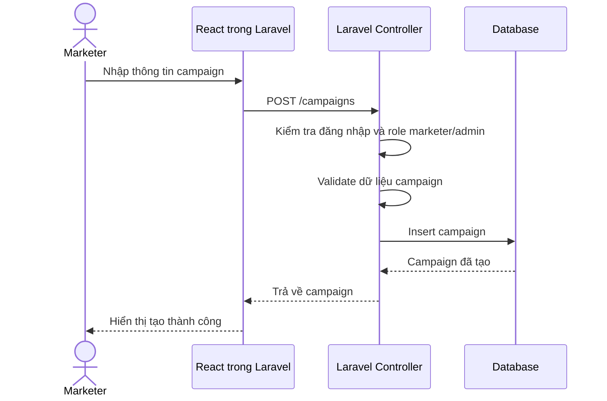
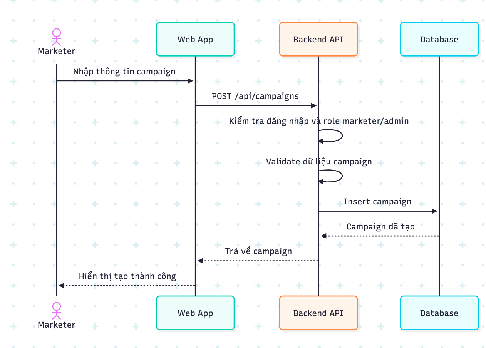
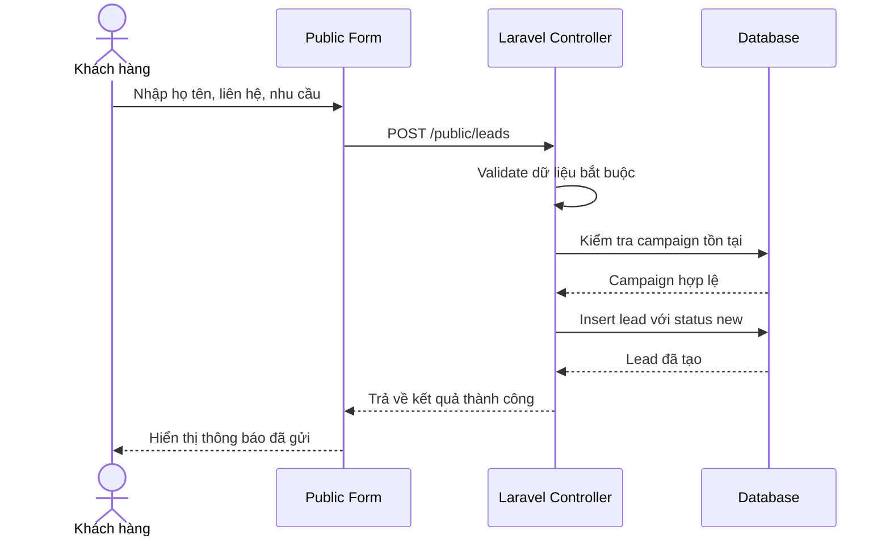
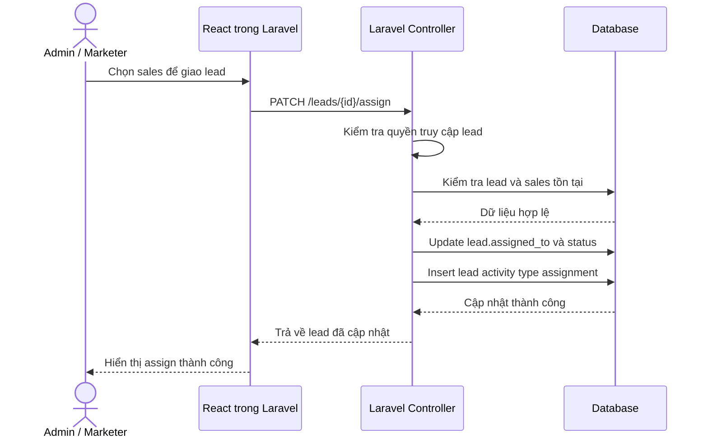
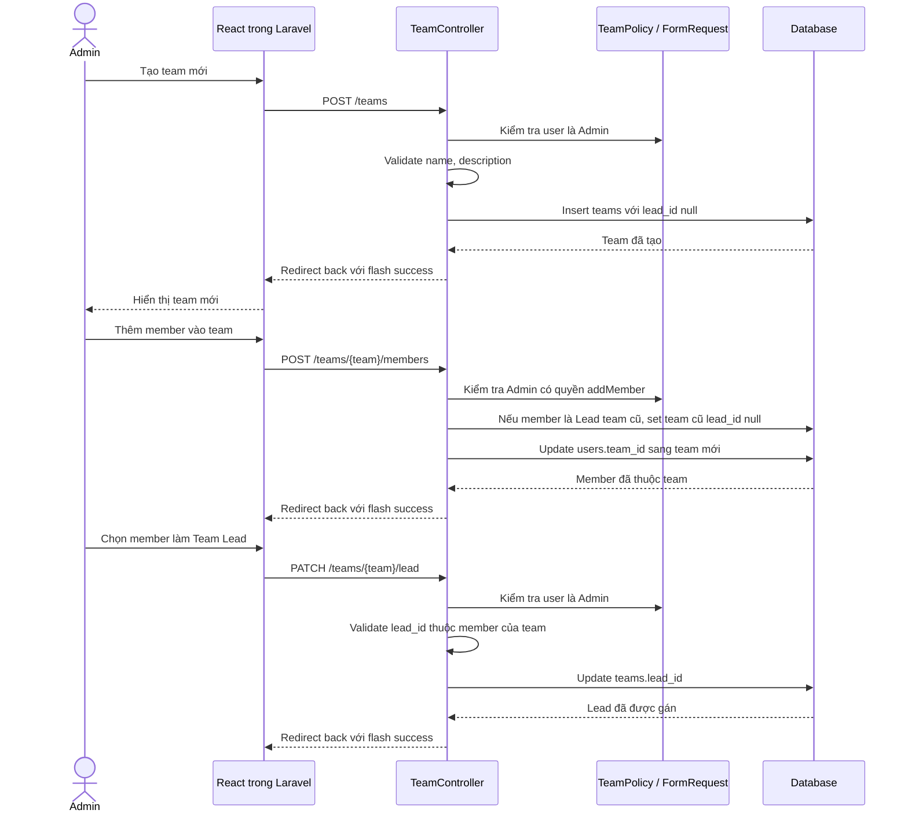
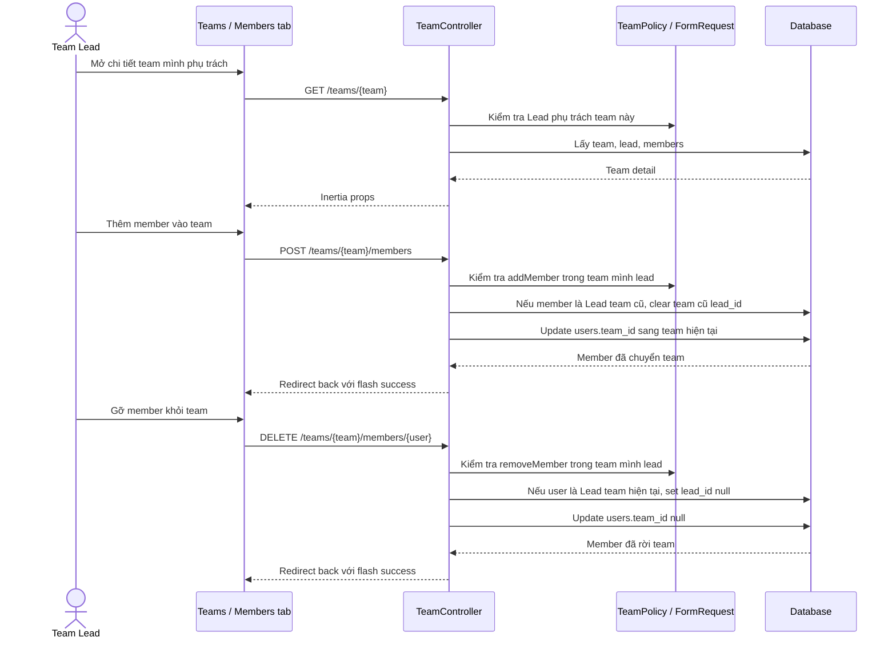
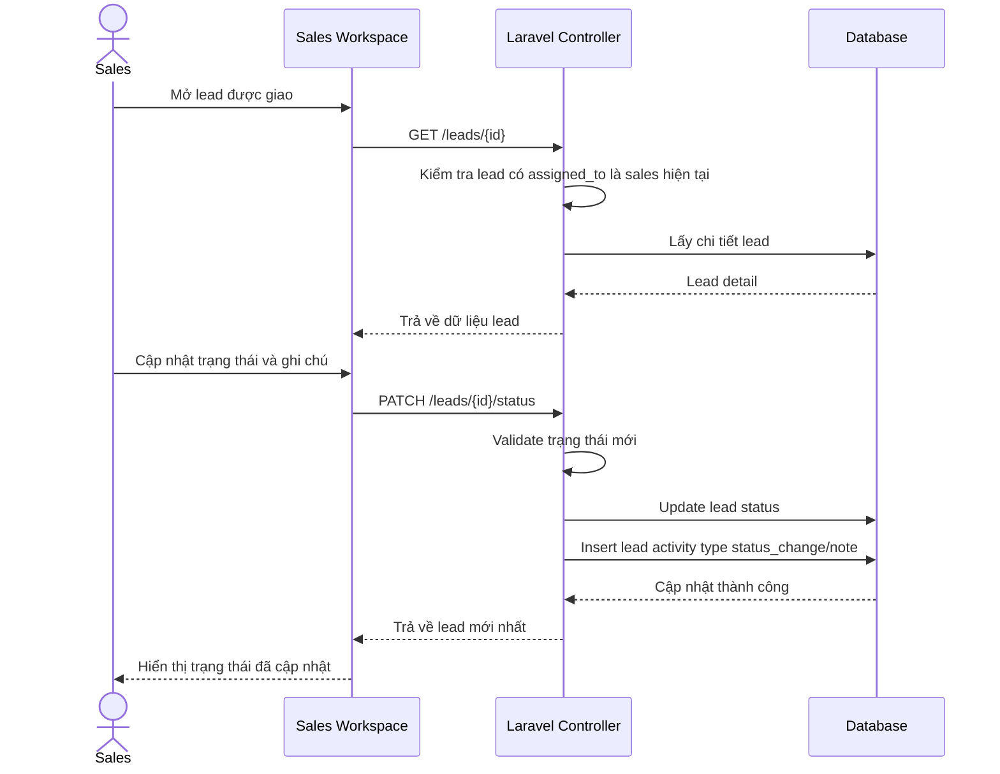
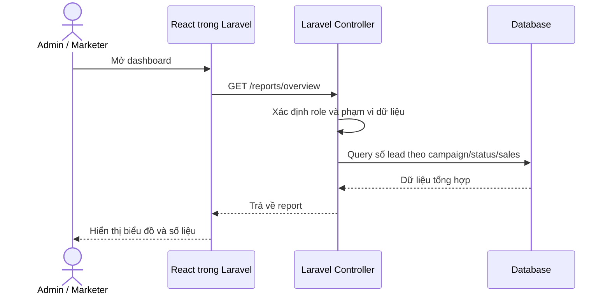

# Sequence Diagrams - CRM mini quản lý lead

## Mục tiêu

Tài liệu này mô tả các luồng xử lý chính theo thứ tự thời gian: người dùng thao tác trên React, request đi vào Laravel route trong `routes/web.php`, controller xử lý ra sao và dữ liệu được lưu ở đâu. Các diagram bên dưới là bản nháp để chỉnh lại theo tên controller, route và database thực tế.

## Luồng tạo campaign

## Luồng khách hàng gửi lead từ public form

## Luồng admin hoặc marketer assign lead cho sales

## Luồng admin tạo team và gán Team Lead

## Luồng Team Lead quản lý member trong team

## Luồng sales cập nhật trạng thái lead

## Luồng xem dashboard

