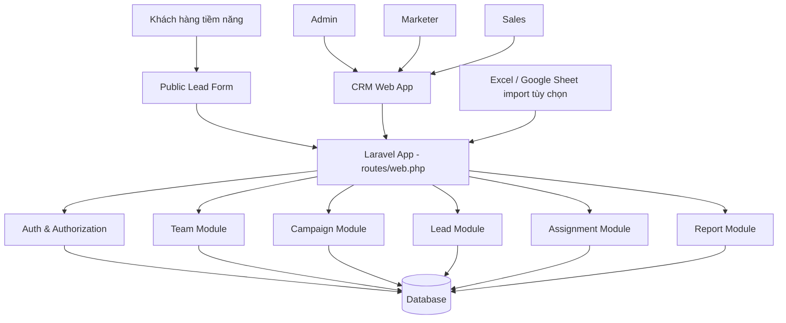

# System Architecture - CRM mini quản lý lead

## Mục tiêu

Hệ thống CRM mini giúp gom lead từ nhiều chiến dịch marketing về một nơi, phân công lead cho sales và theo dõi quá trình xử lý. Dự án dùng PHP Laravel làm ứng dụng chính, route khai báo trong `routes/web.php`, ReactJS đặt trực tiếp trong source Laravel và render qua Inertia.js để xây dựng giao diện.

## Người dùng chính

- Admin: quản lý toàn bộ hệ thống, user, campaign, lead và báo cáo.
- Marketer: tạo campaign, theo dõi lead thuộc campaign của mình.
- Sales: xem lead được giao, cập nhật trạng thái và ghi chú xử lý.
- Team Lead: member được Admin gán làm người phụ trách một team nội bộ.
- Public visitor: gửi thông tin qua public form.

## Thành phần hệ thống

- Laravel Web App: ứng dụng chính, xử lý route trong `routes/web.php`, controller, middleware, validation, Inertia page responses và business logic.
- ReactJS + Inertia.js trong source Laravel: giao diện đăng nhập, dashboard, quản lý campaign, quản lý lead, workspace cho sales và public form. React đặt trong `resources/js/pages` và build bằng Vite.
- Database: lưu users, teams, campaigns, leads, assignments và lead activities.
- Auth module: xác thực người dùng và phân quyền theo role.
- Team module: quản lý team nội bộ, Team Lead và member.
- Report module: tổng hợp số liệu lead theo campaign, sales và trạng thái.
- Optional integrations: import Excel/Google Sheet, webhook từ landing page, email notification hoặc CRM export.

## Sơ đồ kiến trúc tổng quan

## Module chính

### Auth module

Phụ trách đăng nhập, lấy thông tin người dùng hiện tại và kiểm tra quyền truy cập.

Trong Laravel có thể dùng session-based authentication, middleware `auth` và middleware/custom policy để kiểm tra role. Vì route nằm trong `web.php`, các request thay đổi dữ liệu cần đi qua CSRF protection.

Rule chính:

- Admin có quyền toàn hệ thống.
- Team Lead có quyền quản lý member trong team mình phụ trách, nhưng không có quyền tự gán hoặc đổi Team Lead.
- Marketer bị giới hạn theo campaign mình phụ trách.
- Sales bị giới hạn theo lead được assign.
- Public form chỉ có quyền tạo lead.

### Campaign module

Phụ trách tạo, cập nhật, xem danh sách và xem chi tiết campaign.

Campaign giúp team marketing biết lead đến từ chiến dịch nào, từ đó đánh giá hiệu quả các kênh như Facebook Ads, Google Ads, landing page, offline event hoặc referral.

Controller gợi ý: `CampaignController`.

### Team module

Phụ trách tạo team, xem danh sách team, xem chi tiết team, gán hoặc gỡ Team Lead và quản lý members trong team.

Thiết kế dữ liệu:

- `teams.lead_id` lưu Team Lead hiện tại, nullable vì team có thể chưa có Lead.
- `users.team_id` lưu team hiện tại của user, nullable vì member có thể chưa thuộc team nào.
- Không dùng bảng pivot cho team-member vì rule yêu cầu mỗi member chỉ thuộc 0 hoặc 1 team tại một thời điểm.

Rule chính:

- Chỉ Admin được tạo hoặc xóa team.
- Chỉ Admin được gán hoặc gỡ Team Lead.
- Team Lead phải là member đang thuộc chính team đó.
- Team Lead được thêm, xóa và mời member trong team mình phụ trách.
- Khi member chuyển sang team khác, user tự rời team cũ. Nếu user đó là Team Lead của team cũ, team cũ trở về trạng thái chưa có Lead.

Controller gợi ý: `TeamController`. Policy gợi ý: `TeamPolicy`.

### Lead module

Phụ trách tạo lead, xem danh sách lead, cập nhật thông tin lead và trạng thái lead.

Lead là thực thể trung tâm của hệ thống. Mỗi lead nên có campaign, nguồn, trạng thái và người phụ trách nếu đã được giao cho sales.

Controller gợi ý: `LeadController` và `PublicLeadController` cho form public.

### Assignment module

Phụ trách giao lead cho sales và lưu lịch sử giao lead. Module này giúp admin hoặc marketer biết lead đã được ai xử lý.

Action có thể đặt trong `LeadAssignmentController` hoặc tách thành method riêng trong `LeadController`, tùy quy mô code.

### Activity module

Phụ trách lưu ghi chú, cuộc gọi, thay đổi trạng thái và các hoạt động chăm sóc lead. Lịch sử này giúp team không mất ngữ cảnh khi nhiều người cùng theo dõi một lead.

### Report module

Phụ trách tổng hợp số liệu:

- Tổng số lead.
- Lead mới.
- Lead theo trạng thái.
- Lead theo campaign.
- Lead theo sales phụ trách.
- Tỷ lệ chuyển đổi từ lead sang khách hàng.

Controller gợi ý: `ReportController`.

## Cấu trúc Laravel gợi ý

- `routes/web.php`: khai báo route cho toàn bộ trang Inertia React và các action xử lý dữ liệu.
- `app/Http/Controllers`: chứa controller cho auth, campaign, lead, assignment, report.
- `app/Models`: chứa model `User`, `Team`, `Campaign`, `Lead`, `LeadActivity`.
- `app/Policies` hoặc middleware role: kiểm tra quyền theo admin, marketer, sales.
- `database/migrations`: định nghĩa schema database.
- `database/seeders`: tạo tài khoản mẫu admin, marketer, sales.
- `resources/js`: chứa source ReactJS, Inertia bootstrap và page components.
- `resources/views`: chỉ cần một Blade entry point có `@inertia`.
- `vite.config.js`: cấu hình build React asset.

## Luồng nghiệp vụ tổng quát

1. Marketer tạo campaign.
2. Lead được gửi từ public form hoặc nhập thủ công.
3. Lead được lưu với trạng thái ban đầu là `new`.
4. Admin hoặc marketer assign lead cho sales.
5. Sales liên hệ lead và cập nhật trạng thái xử lý.
6. Admin và marketer xem dashboard để đánh giá hiệu quả campaign và hiệu quả sales.

## Luồng quản lý team

1. Admin tạo team mới, chưa bắt buộc có Team Lead.
2. Admin thêm member vào team.
3. Admin chọn một member đang thuộc team làm Team Lead.
4. Team Lead thêm, xóa hoặc mời member trong team mình phụ trách.
5. Nếu Team Lead bị xóa khỏi hệ thống, chuyển sang team khác hoặc bị gỡ khỏi team hiện tại, team giữ nguyên hoạt động nhưng `lead_id` trở về `null`.
6. Admin có thể gán Team Lead mới bất kỳ lúc nào.

## Điều hướng frontend

Sidebar chính dùng menu `Teams` thay cho menu `Members`. Bên trong khu vực Teams có tabs:

- `Teams`: danh sách team và thao tác tạo/xóa team theo quyền.
- `Members`: quản lý danh sách members theo team, role, status và quyền của Admin hoặc Team Lead.

## Phân quyền dữ liệu

| Vai trò   | Phạm vi dữ liệu            | Hành động chính                                                |
| --------- | -------------------------- | -------------------------------------------------------------- |
| Admin     | Toàn bộ hệ thống           | Quản lý user, team, campaign, lead, assign, report             |
| Team Lead | Team mình phụ trách        | Thêm/xóa/mời member trong team, không được đổi Team Lead       |
| Marketer  | Campaign do mình phụ trách | Tạo campaign, xem lead của campaign, assign lead nếu được phép |
| Sales     | Lead được giao             | Xem lead, cập nhật trạng thái, thêm ghi chú                    |
| Public    | Không có quyền đọc dữ liệu | Gửi form tạo lead                                              |
