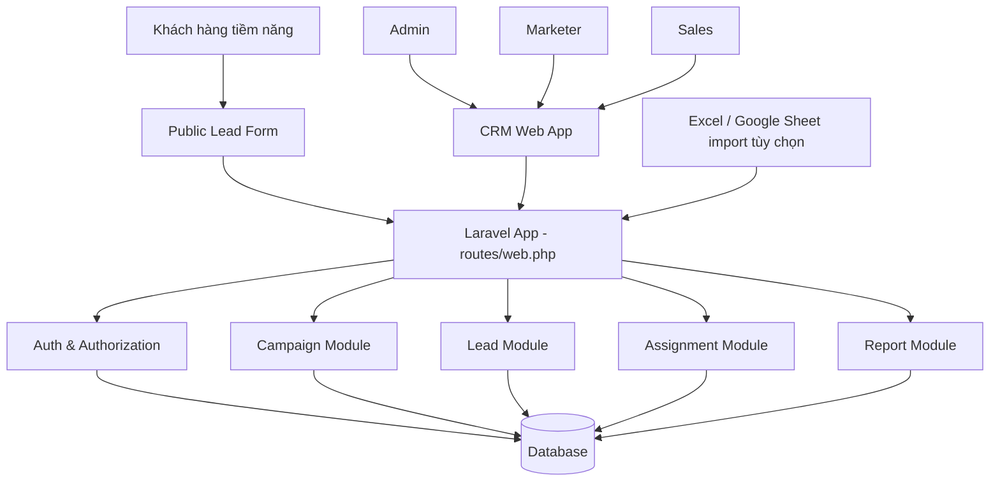
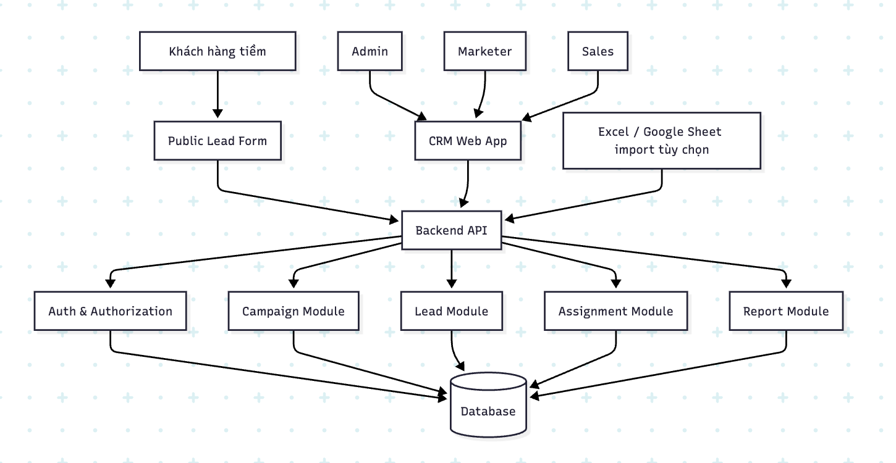

# System Architecture - CRM mini quản lý lead

## Mục tiêu

Hệ thống CRM mini giúp gom lead từ nhiều chiến dịch marketing về một nơi, phân công lead cho sales và theo dõi quá trình xử lý. Dự án dùng PHP Laravel làm ứng dụng chính, route khai báo trong `routes/web.php`, ReactJS đặt trực tiếp trong source Laravel để xây dựng giao diện.

## Người dùng chính

- Admin: quản lý toàn bộ hệ thống, user, campaign, lead và báo cáo.
- Marketer: tạo campaign, theo dõi lead thuộc campaign của mình.
- Sales: xem lead được giao, cập nhật trạng thái và ghi chú xử lý.
- Lead: gửi thông tin qua public form.

## Thành phần hệ thống

- Laravel Web App: ứng dụng chính, xử lý route trong `routes/web.php`, controller, middleware, validation và business logic.
- ReactJS trong source Laravel: giao diện đăng nhập, dashboard, quản lý campaign, quản lý lead, workspace cho sales và public form. React có thể đặt trong `resources/js` và build bằng Vite.
- Database: lưu users, campaigns, leads, assignments và lead activities.
- Auth module: xác thực người dùng và phân quyền theo role.
- Report module: tổng hợp số liệu lead theo campaign, sales và trạng thái.
- Optional integrations: import Excel/Google Sheet, webhook từ landing page, email notification hoặc CRM export.

## Sơ đồ kiến trúc tổng quan

## Module chính

### Auth module

Phụ trách đăng nhập, lấy thông tin người dùng hiện tại và kiểm tra quyền truy cập.

Trong Laravel có thể dùng session-based authentication, middleware `auth` và middleware/custom policy để kiểm tra role. Vì route nằm trong `web.php`, các request thay đổi dữ liệu cần đi qua CSRF protection.

Rule chính:

- Admin có quyền toàn hệ thống.
- Marketer bị giới hạn theo campaign mình phụ trách.
- Sales bị giới hạn theo lead được assign.
- Public form chỉ có quyền tạo lead.

### Campaign module

Phụ trách tạo, cập nhật, xem danh sách và xem chi tiết campaign.

Campaign giúp team marketing biết lead đến từ chiến dịch nào, từ đó đánh giá hiệu quả các kênh như Facebook Ads, Google Ads, landing page, offline event hoặc referral.

Controller gợi ý: `CampaignController`.

### Lead module

Phụ trách tạo lead, xem danh sách lead, cập nhật thông tin lead và trạng thái lead.

Lead là thực thể trung tâm của hệ thống. Mỗi lead nên có campaign, nguồn, trạng thái và người phụ trách nếu đã được giao cho sales.

Controller gợi ý: `LeadController` và `PublicLeadController` cho form public.

### Assignment module

Phụ trách giao lead cho sales và lưu lịch sử giao lead. Module này giúp admin hoặc marketer biết lead đã được ai xử lý.

Action có thể đặt trong `LeadAssignmentController` hoặc tách thành method riêng trong `LeadController`, tùy quy mô code.

### Activity module

Phụ trách lưu ghi chú, cuộc gọi, thay đổi trạng thái và các hoạt động chăm sóc lead. Lịch sử này giúp team không mất ngữ cảnh khi nhiều người cùng theo dõi một lead.

### Report module

Phụ trách tổng hợp số liệu:

- Tổng số lead.
- Lead mới.
- Lead theo trạng thái.
- Lead theo campaign.
- Lead theo sales phụ trách.
- Tỷ lệ chuyển đổi từ lead sang khách hàng.

Controller gợi ý: `ReportController`.

## Cấu trúc Laravel gợi ý

- `routes/web.php`: khai báo route cho toàn bộ trang React và các action xử lý dữ liệu.
- `app/Http/Controllers`: chứa controller cho auth, campaign, lead, assignment, report.
- `app/Models`: chứa model `User`, `Campaign`, `Lead`, `LeadActivity`.
- `app/Policies` hoặc middleware role: kiểm tra quyền theo admin, marketer, sales.
- `database/migrations`: định nghĩa schema database.
- `database/seeders`: tạo tài khoản mẫu admin, marketer, sales.
- `resources/js`: chứa source ReactJS.
- `resources/views`: chỉ cần một Blade entry point để mount React nếu dùng React SPA trong Laravel.
- `vite.config.js`: cấu hình build React asset.

## Luồng nghiệp vụ tổng quát

1. Marketer tạo campaign.
2. Lead được gửi từ public form hoặc nhập thủ công.
3. Lead được lưu với trạng thái ban đầu là `new`.
4. Admin hoặc marketer assign lead cho sales.
5. Sales liên hệ lead và cập nhật trạng thái xử lý.
6. Admin và marketer xem dashboard để đánh giá hiệu quả campaign và hiệu quả sales.

## Phân quyền dữ liệu

| Vai trò  | Phạm vi dữ liệu            | Hành động chính                                                |
| -------- | -------------------------- | -------------------------------------------------------------- |
| Admin    | Toàn bộ hệ thống           | Quản lý user, campaign, lead, assign, report                   |
| Marketer | Campaign do mình phụ trách | Tạo campaign, xem lead của campaign, assign lead nếu được phép |
| Sales    | Lead được giao             | Xem lead, cập nhật trạng thái, thêm ghi chú                    |
| Public   | Không có quyền đọc dữ liệu | Gửi form tạo lead                                              |
