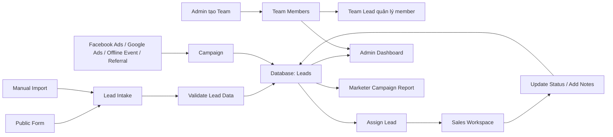

# Data Flow - CRM mini quản lý lead

## Mục tiêu

Tài liệu này mô tả dữ liệu của hệ thống CRM mini đi từ đâu, được xử lý như thế nào, được lưu ở đâu và từng nhóm người dùng có quyền truy cập dữ liệu nào. Hệ thống phục vụ bài toán gom lead từ nhiều chiến dịch marketing về một nơi để marketer, sales và admin cùng theo dõi trạng thái xử lý lead.

## Nguồn phát sinh dữ liệu

Lead có thể được tạo từ các nguồn sau:

- Marketer hoặc admin nhập thủ công lead vào hệ thống.
- Khách hàng điền form public trên landing page hoặc form tư vấn.
- Lead được tổng hợp từ các chiến dịch như Facebook Ads, Google Ads, sự kiện offline, referral hoặc các kênh marketing khác.
- Dữ liệu có thể được nhập lại từ Google Sheet, Excel, email hoặc inbox nếu dự án có hỗ trợ import.

Campaign được tạo bởi marketer hoặc admin để gom các lead cùng một chiến dịch. Mỗi lead nên gắn với một campaign để sau này đo hiệu quả chiến dịch.

Team được tạo bởi Admin để gom user nội bộ theo nhóm làm việc. Team có thể chưa có Lead, hoặc có một Team Lead do Admin gán từ chính member đang thuộc team đó.

## Luồng dữ liệu chính

1. Marketer tạo campaign với tên chiến dịch, mô tả, nguồn, thời gian chạy và trạng thái chiến dịch.
2. Lead được tạo từ form public hoặc được nhập thủ công trong trang quản trị.
3. Laravel controller kiểm tra dữ liệu bắt buộc như họ tên, số điện thoại, email, nguồn lead và campaign.
4. Lead được lưu vào database với trạng thái ban đầu, ví dụ `new`.
5. Admin hoặc marketer assign lead cho sales phụ trách.
6. Sales xem danh sách lead được giao và cập nhật trạng thái xử lý như đã gọi, đang tư vấn, tiềm năng, đã chuyển đổi hoặc không phù hợp.
7. Admin xem toàn bộ dữ liệu lead, campaign và hiệu quả xử lý.
8. Marketer xem lead thuộc campaign của mình để đánh giá chất lượng chiến dịch.

## Luồng dữ liệu team/member

1. Admin tạo team với tên và mô tả, Lead là optional.
2. Admin thêm member vào team. Nếu member đang thuộc team khác, backend cập nhật `users.team_id` sang team mới để member tự rời team cũ.
3. Nếu member vừa chuyển team đang là Lead của team cũ, backend set `teams.lead_id = null` cho team cũ.
4. Admin gán Team Lead bằng cách chọn một member đang thuộc team đó.
5. Team Lead quản lý trong phạm vi team mình phụ trách: thêm member, xóa member và mời member.
6. Team Lead không được tự gán, đổi hoặc gỡ Team Lead; quyền này chỉ thuộc Admin.
7. Nếu Team Lead bị xóa khỏi hệ thống hoặc bị gỡ khỏi team hiện tại, team vẫn hoạt động và `lead_id` trở về `null`.

## Dữ liệu được lưu trữ

Nhóm dữ liệu chính của hệ thống gồm:

- User: thông tin tài khoản và vai trò như admin, marketer, sales.
- Team: thông tin team nội bộ, Lead phụ trách và danh sách member qua `users.team_id`.
- Campaign: thông tin chiến dịch marketing.
- Lead: thông tin khách hàng tiềm năng và trạng thái xử lý.
- Assignment: thông tin lead được giao cho sales nào, ai giao và thời điểm giao.
- Activity hoặc Lead Note: lịch sử chăm sóc, ghi chú, cuộc gọi, thay đổi trạng thái.

## Phân quyền truy cập dữ liệu

- Admin: xem và thao tác toàn bộ user, campaign, lead, assignment và báo cáo.
- Team Lead: quản lý member trong team mình phụ trách, không được gán hoặc đổi Team Lead.
- Marketer: tạo và quản lý campaign của mình, xem lead thuộc campaign do mình phụ trách.
- Sales: xem lead được giao cho mình, cập nhật trạng thái xử lý và ghi chú chăm sóc.
- Public user: chỉ gửi thông tin qua form public, không được xem dữ liệu trong hệ thống.

## Dữ liệu nhạy cảm

Lead có thể chứa dữ liệu cá nhân như họ tên, số điện thoại, email, nhu cầu tư vấn và ghi chú trao đổi. Khi triển khai thực tế, hệ thống cần:

- Chỉ hiển thị dữ liệu theo đúng vai trò.
- Không trả về dữ liệu lead không thuộc phạm vi người dùng hiện tại.
- Không trả về danh sách team/member ngoài phạm vi quyền của người dùng hiện tại.
- Không ghi log thông tin nhạy cảm như số điện thoại đầy đủ hoặc nội dung tư vấn chi tiết nếu không cần thiết.
- Có cơ chế cập nhật hoặc xóa lead khi cần theo yêu cầu vận hành.

## Data flow tổng quát

