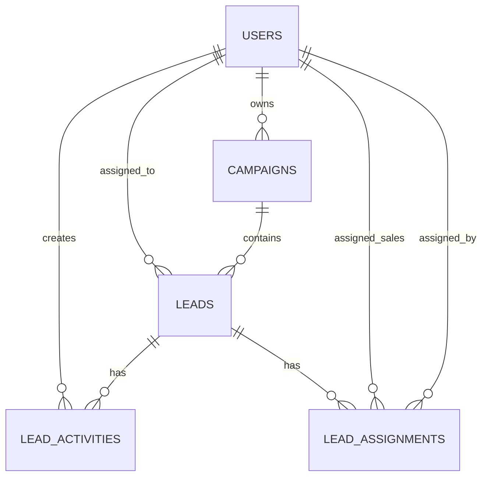

là bản thiết kế cấu trúc dữ liệu — bảng nào, cột nào, index nào, quan hệ ra sao. Đây là nền tảng để viết migration, tránh refactor schema tốn kém về sau.

# Database Schema - CRM mini quản lý lead

## Mục tiêu

Database cần lưu được campaign, lead, người dùng và quá trình sales xử lý lead. Schema dưới đây là bản nháp để triển khai migration hoặc chỉnh lại theo ORM/framework đang dùng trong dự án.

## Bảng users

Lưu thông tin tài khoản đăng nhập hệ thống.

| Cột           | Kiểu dữ liệu gợi ý | Mô tả                        |
| ------------- | ------------------ | ---------------------------- |
| id            | UUID / bigint      | Khóa chính                   |
| name          | varchar            | Tên người dùng               |
| email         | varchar unique     | Email đăng nhập              |
| password_hash | varchar            | Mật khẩu đã hash             |
| role          | enum               | `admin`, `marketer`, `sales` |
| status        | enum               | `active`, `inactive`         |
| created_at    | timestamp          | Thời điểm tạo                |
| updated_at    | timestamp          | Thời điểm cập nhật           |

Index gợi ý:

- `users_email_unique` trên `email`
- `users_role_index` trên `role`

## Bảng campaigns

Lưu thông tin chiến dịch marketing.

| Cột         | Kiểu dữ liệu gợi ý   | Mô tả                                                                  |
| ----------- | -------------------- | ---------------------------------------------------------------------- |
| id          | UUID / bigint        | Khóa chính                                                             |
| name        | varchar              | Tên chiến dịch                                                         |
| source      | varchar / enum       | Nguồn: Facebook Ads, Google Ads, landing page, offline event, referral |
| description | text                 | Mô tả chiến dịch                                                       |
| owner_id    | foreign key users.id | Marketer phụ trách                                                     |
| status      | enum                 | `draft`, `active`, `paused`, `completed`                               |
| start_date  | date nullable        | Ngày bắt đầu                                                           |
| end_date    | date nullable        | Ngày kết thúc                                                          |
| created_at  | timestamp            | Thời điểm tạo                                                          |
| updated_at  | timestamp            | Thời điểm cập nhật                                                     |

Quan hệ:

- Một campaign thuộc về một marketer hoặc admin qua `owner_id`.
- Một campaign có nhiều lead.

Index gợi ý:

- `campaigns_owner_id_index` trên `owner_id`
- `campaigns_status_index` trên `status`
- `campaigns_source_index` trên `source`

## Bảng leads

Lưu thông tin khách hàng tiềm năng.

| Cột         | Kiểu dữ liệu gợi ý            | Mô tả                                                            |
| ----------- | ----------------------------- | ---------------------------------------------------------------- |
| id          | UUID / bigint                 | Khóa chính                                                       |
| campaign_id | foreign key campaigns.id      | Campaign tạo ra lead                                             |
| full_name   | varchar                       | Tên lead                                                         |
| phone       | varchar nullable              | Số điện thoại                                                    |
| email       | varchar nullable              | Email                                                            |
| company     | varchar nullable              | Công ty nếu có                                                   |
| need        | text nullable                 | Nhu cầu tư vấn                                                   |
| source      | varchar / enum                | Nguồn lead cụ thể                                                |
| status      | enum                          | `new`, `assigned`, `contacted`, `qualified`, `converted`, `lost` |
| score       | integer nullable              | Điểm tiềm năng nếu có chấm điểm                                  |
| created_by  | foreign key users.id nullable | Người nhập lead                                                  |
| created_at  | timestamp                     | Thời điểm tạo                                                    |
| updated_at  | timestamp                     | Thời điểm cập nhật                                               |

Quan hệ:

- Một lead thuộc về một campaign.
- Một lead có thể được giao cho nhiều sales.
- Một lead có thể có nhiều ghi chú hoặc hoạt động chăm sóc.

Index gợi ý:

- `leads_campaign_id_index` trên `campaign_id`
- `leads_assigned_to_index` trên `assigned_to`
- `leads_status_index` trên `status`
- `leads_phone_index` trên `phone`
- `leads_email_index` trên `email`

## Bảng lead_activities

Lưu lịch sử xử lý lead để biết sales đã làm gì và khi nào.

| Cột        | Kiểu dữ liệu gợi ý   | Mô tả                                                             |
| ---------- | -------------------- | ----------------------------------------------------------------- |
| id         | UUID / bigint        | Khóa chính                                                        |
| lead_id    | foreign key leads.id | Lead liên quan                                                    |
| user_id    | foreign key users.id | Người thực hiện                                                   |
| type       | enum                 | `note`, `call`, `status_change`, `assignment`, `email`, `meeting` |
| content    | text nullable        | Nội dung ghi chú hoặc mô tả hoạt động                             |
| old_status | varchar nullable     | Trạng thái cũ nếu là đổi trạng thái                               |
| new_status | varchar nullable     | Trạng thái mới nếu là đổi trạng thái                              |
| created_at | timestamp            | Thời điểm tạo hoạt động                                           |

Index gợi ý:

- `lead_activities_lead_id_index` trên `lead_id`
- `lead_activities_user_id_index` trên `user_id`
- `lead_activities_type_index` trên `type`

## Bảng lead_assignments tùy chọn

Nếu cần lưu lịch sử giao lead riêng với activity, có thể tách bảng assignment.

| Cột         | Kiểu dữ liệu gợi ý   | Mô tả           |
| ----------- | -------------------- | --------------- |
| id          | UUID / bigint        | Khóa chính      |
| lead_id     | foreign key leads.id | Lead được giao  |
| sales_id    | foreign key users.id | Sales nhận lead |
| assigned_by | foreign key users.id | Người giao lead |
| assigned_at | timestamp            | Thời điểm giao  |

## Quy tắc dữ liệu

- Lead nên có ít nhất một kênh liên hệ: phone hoặc email.
- Lead mới tạo từ form public có trạng thái ban đầu là `new`.
- Khi lead được giao cho sales, có thể đổi trạng thái sang `assigned`.
- Sales chỉ cập nhật lead được giao cho mình.
- Marketer chỉ xem lead thuộc campaign do mình phụ trách, trừ khi là admin.
- Admin có toàn quyền xem và chỉnh sửa dữ liệu.

## ERD gợi ý

